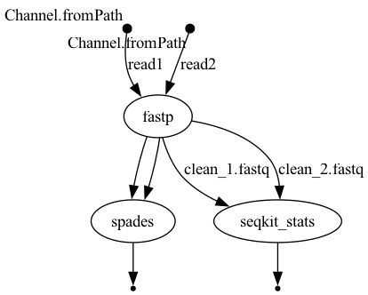

# Nextflow Workflow (BIOL7210 at GATECH Spring 2025)
**Author**: Anna Cho

This repository contains a simple Nextflow DSL2 workflow developed for BIOL7210 coursework.  
The workflow demonstrates both **sequential** and **parallel** processing using three genomics tools: `fastp`, `spades`, and `seqkit`.

---

## Workflow Overview

**Step-by-step:**

1. `fastp`: Performs quality trimming on **paired-end FASTQ** files.
2. `spades`: Assembles the cleaned paired reads into contigs (**sequential** step after fastp).
3. `seqkit stats`: Generates statistics on the cleaned reads (**parallel** with spades).

---

## Workflow DAG



This DAG diagram was generated by running:

```bash
nextflow run main.nf -profile docker -with-dag flow.png

---

## Test Data

Paired-end FASTQ test files are included in the data/ directory:

```
data/mini_1.fastq  
data/mini_2.fastq
```
These were created by subsampling from the public dataset ERR1755086 (European Nucleotide Archive).


---

## Software Requirements

- **Nextflow**: v24.10.5  
- **Docker**: v27.4.0  
- **OS**: macOS (Apple M1, arm64 architecture)

The tools used are all containerized from BioContainers:

- `fastp`
- `spades`
- `seqkit`

---

## How to Run

After cloning the repo and navigating to the directory, execute:

```
nextflow run main.nf -profile docker
```

---

## Output Files

Output files will be saved in the `results/` directory:

- clean_1.fastq, clean_2.fastq: Trimmed paired-end reads from fastp
- spades_output/: Genome assembly output from spades
- seqkit_stats.txt: Read statistics summary from seqkit

---